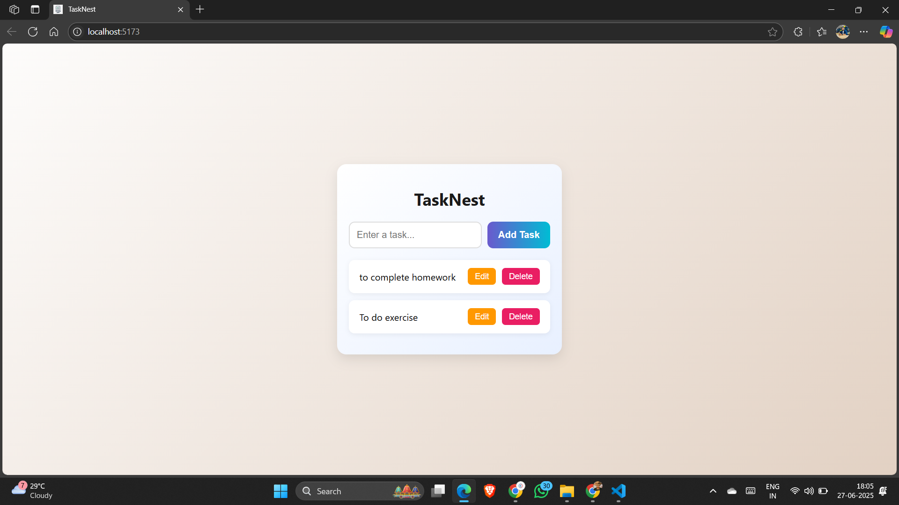
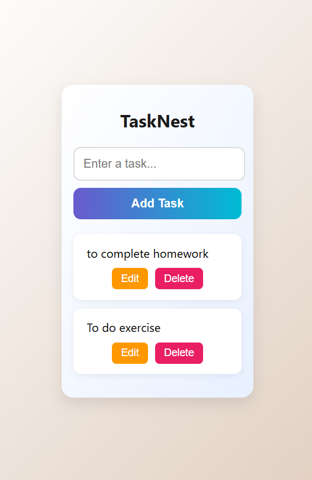

# ✅ TaskNest – Todo List Web App

A sleek and **responsive Todo List web application** built with **React.js** and **Core CSS**. TaskNest helps you stay organized with a simple yet elegant UI for managing daily tasks—add, edit, complete, and delete with ease.

---

## 🚀 Features

- 📝 Add New Tasks
- ✏️ Edit Existing Tasks
- ✅ Mark Tasks as Completed
- 🗑️ Delete Tasks
- 📱 Fully Responsive Design
- 💾 Data saved in LocalStorage
- 🎨 Soft Gradient UI with Custom Buttons

> 🔒 No login required. All your tasks are stored in your browser.

---

## 🛠️ Tech Stack

| Technology   | Description                      |
|--------------|----------------------------------|
| React.js     | Frontend UI Framework            |
| Core CSS     | Custom Styling with Gradient     |
| LocalStorage | Persistent Data Without Backend  |

---

## 🧩 Getting Started

### 1️⃣ Clone the Repository

```bash
git clone https://github.com/KFS-developer/todo_list.git
```

### 2️⃣ Install Dependencies

```bash
npm install
```

### 3️⃣ Start React App

```bash
npm run dev
```

---

## 🌄 Screenshots
	
| Desktop View | Mobile View |
|--------------|-------------|
|  |  |

---

## 🌍 Live Demo

Coming soon...  
Host your frontend using **Vercel**/**Netlify** and backend via **Render**/**Glitch**.

---

## 👤 Author

**Patel Ketul**  

---

## 📃 License

Licensed under the [MIT License](LICENSE)

> ⭐ If you liked this project, please consider starring it on GitHub!